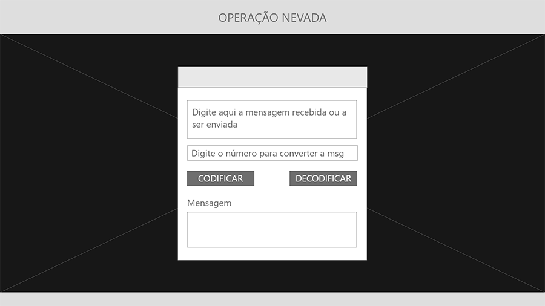
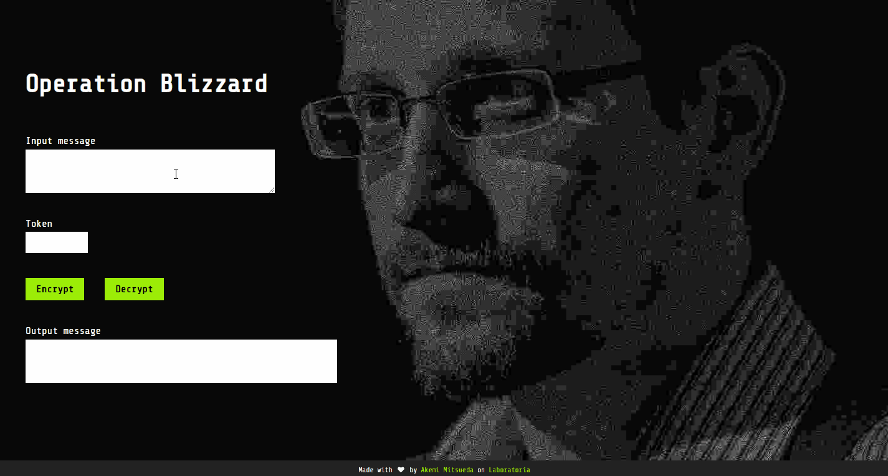

# Operation Blizzard
*Uma aplicação simples para troca de mensagens codificadas*

 

## Índice
1. [Introdução](#-introdução)
2. [Desenvolvimento](#-desenvolvimento)
3. [Funcionamento](#-funcionamento)
4. [Tecnologias](#-tecnologias)

---

 

## 📥 Introdução
Este é o primeiro projeto desenvolvido por mim no bootcamp de front-end da [Laboratoria](https://www.laboratoria.la/br) (Turma SAP005), cuja premissa era fazer uma aplicação para criptografar e descriptografar mensagens utilizando a Cifra de César. O tempo dado foram 2 sprints (2 semanas dentro da metodologia Agile).

[Clique aqui](https://github.com/Laboratoria/SAP005-cipher) para ver a apresentação do desafio no GitHub.

 

## 👩‍💻 Desenvolvimento
### 👉 Planejamento
Todo o planejamento foi realizado com o [Trello](https://trello.com/), utilizando o modelo de Kanban sugerido pelas mentoras do bootcamp.

### 👉 Tema
Inspirada pela história de vazamento de dados da NSA por [Edward Snowden](https://pt.wikipedia.org/wiki/Edward_Snowden), decidi que o tema do meu projeto seria para a troca de mensagens em código entre funcionários de governos e instituições governamentais corruptas e pessoas de fora dessas instituições, principalmente jornalistas.

### 👉 Interface
Desenvolvi o protótipo do UI no Adobe XD por já ter familiaridade com o programa. A ideia é que a interface fosse simples e enxuta, apenas com as funcionalidades necessárias exibidas de forma clara.

*Wireframe inicial*

A imagem de fundo utilizada na aplicação pronta é uma foto editada; a original foi feita por Lindsay Mills, esposa de Snowden, e ilustra [este artigo](https://www.nytimes.com/2019/09/13/books/review-permanent-record-edward-snowden-memoir.html) do NY Times.

 

## ⚙️ Funcionamento
### 👉 Solução
Como já descrito anteriormente, a *Operation Blizzard* (ou *Operação Nevasca*, em Português Brasileiro) tem como foco atender dois tipos de usuários:

- Funcionários de governos que queiram compartilhar informações relevantes para a sociedade
- Jornalistas investigativos

O projeto foi traduzido para o inglês para que pessoas de outros países além do Brasil também possam utilizar a aplicação.

A comunicação entre essas pessoas deve ser mantida em segredo para que a segurança de todos os envolvidos seja garantida. Instituições estatais que tenham informações internas vazadas podem ter meios diversos para abafar e perseguir quem vaza e quem recebe o material comprometedor.

A *Operation Blizzard* foi desenvolvida para que essa comunicação entre as partes pudesse se dar de forma mais segura. Ainda que um terceiro veja uma mensagem criptografada, sem o **token** (ou **senha**) especial, a mensagem será somente um monte de letras embaralhadas.

### 👉 Caracteres aceitos
É aceita a entrada dos seguintes tipos de caracteres na aplicação:

- Letras maiúsculas com e sem acento
- Letras minúsculas com e sem acento
- Números
- Espaços
- Caracteres especiais (como ?, !, @, etc.)

No caso da **senha**, são aceitos *apenas números*, que podem possuir valores *positivos* ou *negativos*.

### 👉 Passo a passo

A mensagem é inserida no campo de **Input message**, o usuário coloca o número **Token** e, ao apertar o botão **Encrypt**, a mensagem é criptografada. O resultado aparecerá em **Output message**.

Da mesma forma, caso uma mensagem já criptografada seja recebida, ela deve ser inserida como **Input message**, coloca-se o mesmo **Token** e ao clicar em **Decrypt**, a mensagem é descriptografada e o resultado se tornará visível no campo **Output message**.

Para copiar a mensagem traduzida, o usuário deve clicar em **Copy**, e para resetar os campos de **Input message** e **Token**, é só clicar em **Clear**.

 

## 💻 Tecnologias
Estas foram as linguagens utilizadas para construir esta aplicação:

- HTML5
- CSS3
- JavaScript