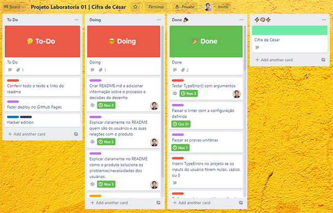
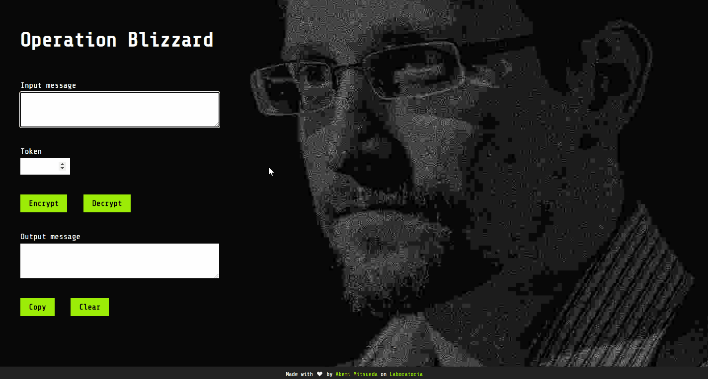

# Operation Blizzard
*Uma aplicação simples para troca de mensagens codificadas*

<br>

## Índice
1. [Introdução](#📥-introdução)
2. [Desenvolvimento](#👩💻-desenvolvimento)
3. [Funcionamento](#⚙️-funcionamento)
4. [Setup](#🧰-setup)

---

<br>

## 📥 Introdução
Este é o primeiro projeto desenvolvido por mim no bootcamp de front-end da [Laboratoria](https://www.laboratoria.la/br) (Turma SAP005), cuja premissa era fazer uma aplicação para criptografar e descriptografar mensagens utilizando a Cifra de César. O tempo dado foram 2 sprints (2 semanas dentro da metodologia Agile).

[Clique aqui](https://github.com/Laboratoria/SAP005-cipher) para ver a apresentação do desafio no GitHub.

<br>

## 👩‍💻 Desenvolvimento
### 👉 Planejamento
Todo o planejamento foi realizado com o [Trello](https://trello.com/), utilizando o modelo de Kanban sugerido pelas mentoras do bootcamp.



### 👉 Tema
Inspirada pela história de vazamento de dados da NSA por [Edward Snowden](https://pt.wikipedia.org/wiki/Edward_Snowden), decidi que o tema do meu projeto seria para a troca de mensagens em código entre funcionários de governos e instituições governamentais corruptas e pessoas de fora dessas instituições, principalmente jornalistas.

### 👉 Interface
Desenvolvi o protótipo do UI no Adobe XD por já ter familiaridade com o programa. A ideia é que a interface fosse simples e enxuta, apenas com as funcionalidades necessárias exibidas de forma clara.


*Wireframe inicial*

A imagem de fundo utilizada na aplicação pronta é uma foto editada; a original foi feita por Lindsay Mills, esposa de Snowden, e ilustra [este artigo](https://www.nytimes.com/2019/09/13/books/review-permanent-record-edward-snowden-memoir.html) do NY Times.


<br>

## ⚙️ Funcionamento
### 👉 Solução
Como já descrito anteriormente, a *Operation Blizzard* (ou *Operação Nevasca*, em Português Brasileiro) tem como foco atender dois tipos de usuários:

- Funcionários de governos que queiram compartilhar informações relevantes para a sociedade
- Jornalistas investigativos 

A comunicação entre essas pessoas deve ser mantida em segredo para que a segurança de todos os envolvidos seja garantida. Instituições estatais que tenham informações internas vazadas podem ter meios diversos para abafar e perseguir quem vaza e quem recebe o material comprometedor.

A *Operation Blizzard* foi desenvolvida para que essa comunicação entre as partes pudesse se dar de forma mais segura. Ainda que um terceiro veja uma mensagem criptografada, sem o **token** (ou **senha**) especial, a mensagem será somente um monte de letras embaralhadas.

O projeto foi traduzido para o inglês para que pessoas de outros países além do Brasil também possam utilizar a aplicação.

### 👉 Passo a passo


A mensagem é inserida no campo de __Input message__, o usuário coloca o número __Token__ e, ao apertar o botão __Encrypt__, a mensagem é criptografada. O resultado aparecerá em __Output message__.

Da mesma forma, caso uma mensagem já criptografada seja recebida, ela deve ser inserida como **Input message**, coloca-se o mesmo **Token** e ao clicar em **Decrypt**, a mensagem é descriptografada e o resultado se tornará visível no campo **Output message**.

<br>

## 🧰 Setup
Para rodar esse projeto no seu computador, você vai precisar das ferramentas abaixo. Clique nos links para baixá-las direto das páginas oficiais:

- [Node.js](https://nodejs.org/en/)
- [npm](https://www.npmjs.com/get-npm)
- [Git](https://git-scm.com/)

Abra seu terminal e digite:

```
git clone https://github.com/akemimeka/SAP005-cipher
```

E para fazer o projeto rodar:
```
npm start
```